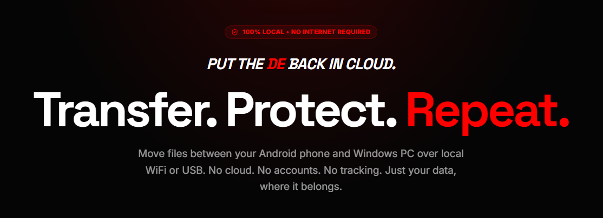
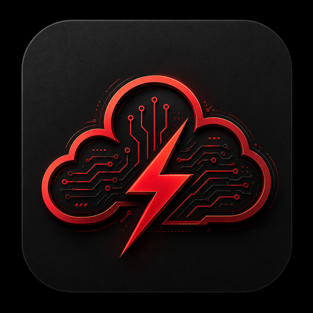
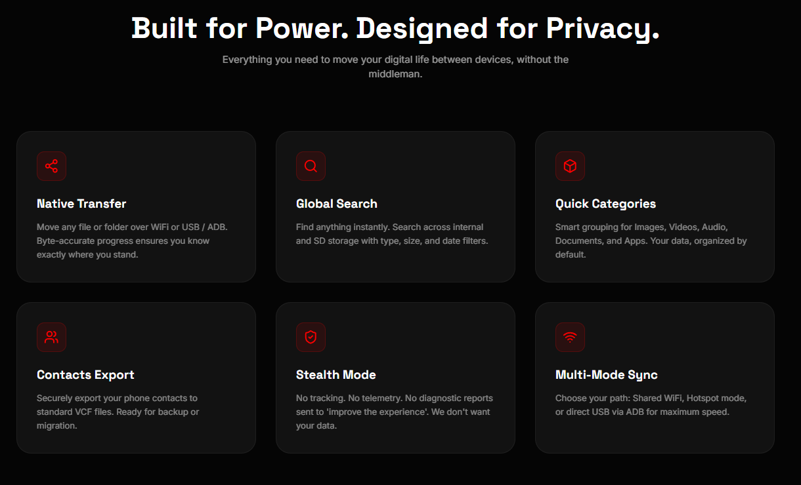
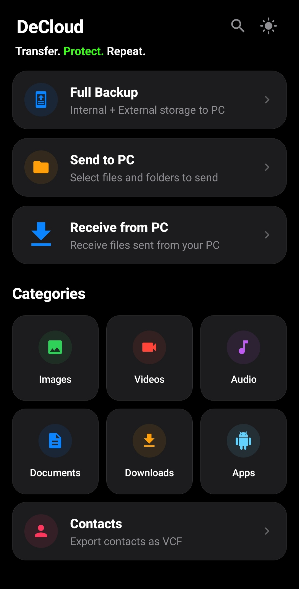
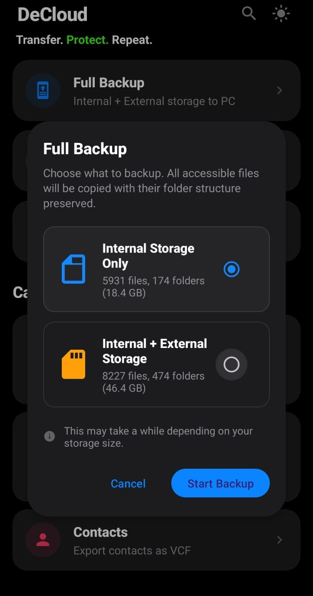
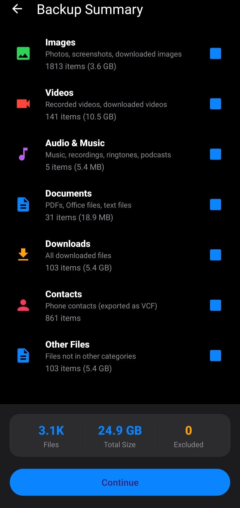
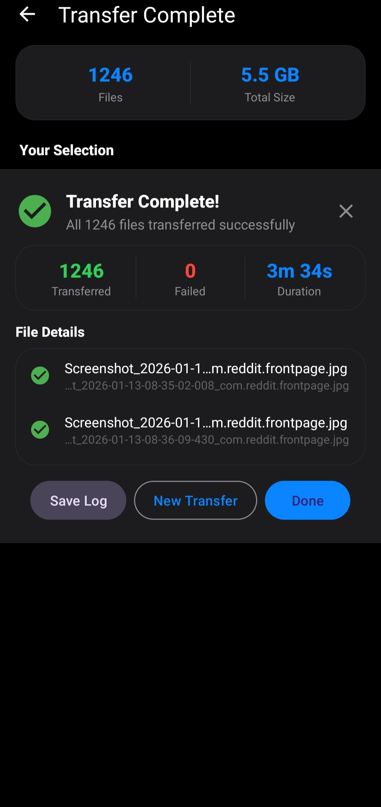
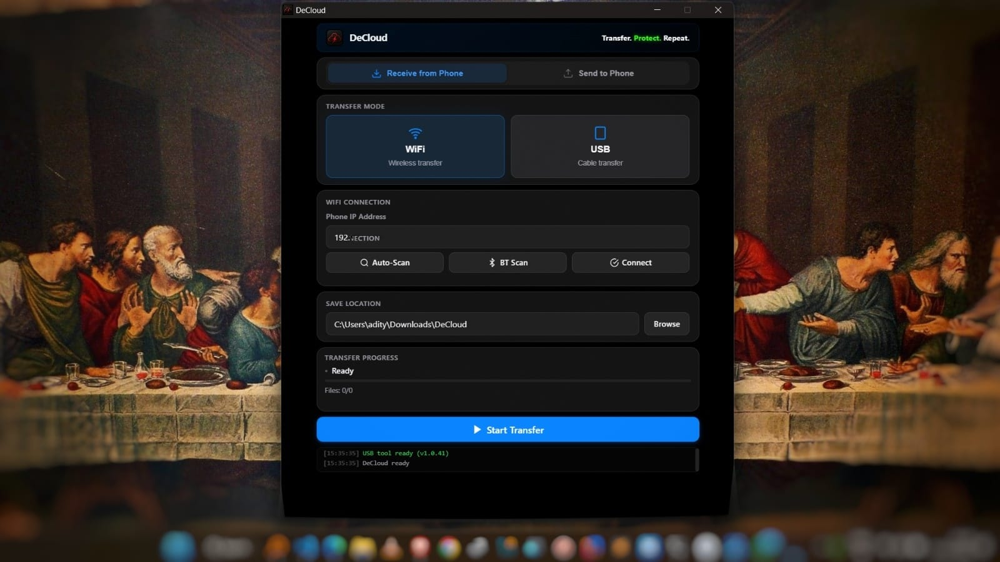

<div align="center">



<br /><br />



# DeCloud

DeCloud moves files between your Android phone and your Windows PC over local WiFi or USB.
**No cloud. No accounts. No tracking. No internet required.**

[](LICENSE)
[]()
[](https://github.com/ad-chd/DeCloud/releases/latest)
[](https://github.com/ad-chd/DeCloud/releases)
[](https://github.com/ad-chd/DeCloud/stargazers)
[](https://github.com/ad-chd/DeCloud/commits/main)

<br /><br />



</div>

---

## Why DeCloud?

Moving files between your phone and your PC should be simple, fast, and private. DeCloud is built around exactly that.

Files travel directly from your phone to your PC over your home WiFi or a USB cable. Nothing leaves your local network. No cloud server in the middle, no account to create, no company (including me) ever sees your files.

If you doubt that promise, **read the source.** The whole reason this repository is open is so you don't have to take my word for it.

---

## Features

- 📁 **Transfer any file or folder** over WiFi or USB / ADB
- 🔍 **Global search** across all storage (internal + SD card) with type, size, and date filters
- 🖼️ **Quick categories**: Images, Videos, Audio, Documents, Downloads, Apps
- 👤 **Contacts export** to standard VCF
- 📊 **Real-time progress** with byte-accurate percentage (not file-count based)
- 🌗 **Dark / Light themes** with smooth circular-reveal transition
- 🔌 **Three transfer modes**: WiFi hotspot, shared WiFi, USB / ADB
- 🆓 **Zero ads, zero accounts, zero internet**

---

## Install

| Where | Status |
|---|---|
| **Google Play Store** | *coming soon* |
| **GitHub Releases** (sideload APK) | [Latest release](../../releases/latest) |

The desktop companion is bundled in the [GitHub Releases](../../releases/latest) as a portable `.exe` (no installer required).

---

## Screenshots

<div align="center">

| Home | Backup | Summary | Complete |
|:---:|:---:|:---:|:---:|
|  |  |  |  |

**Desktop companion (Windows)**



</div>

---

## Watch the walkthrough

<div align="center">

[](https://www.youtube.com/watch?v=FiuMh-KfyUQ)

▶ **[Watch on YouTube](https://www.youtube.com/watch?v=FiuMh-KfyUQ)** — full 2-minute walkthrough: setup, transfer, verify.

</div>

---

## Build from source

### Android app

```bash
cd DeCloud-Android
./gradlew installDebug
```

Requirements: Android Studio, JDK 11, Android SDK 34+.

### Desktop app (Electron)

```bash
cd DeCloud-Desktop
npm install
npm start            # dev mode
npm run build:portable   # build standalone .exe
```

Requirements: Node.js 18+.

---

## Privacy

DeCloud never sends your data anywhere. Period.
Full policy: [PRIVACY.md](./PRIVACY.md).

If you find a bug that affects user privacy, please follow the responsible disclosure process in [SECURITY.md](./SECURITY.md).

---

## Support the creator

DeCloud is built and maintained by one person in their spare time, with no company behind it. There's no donation page. I just want the project to be useful.

If DeCloud saved you time or trouble, the things that genuinely help:

- ⭐ **Star this repository.** Costs nothing, helps a lot with visibility.
- 🐛 **Report bugs** or suggest features via [Issues](../../issues).
- 💬 **Tell someone** who's struggling with phone-to-PC transfers.
- 📧 **Email me** at **adityachaudhary703@gmail.com**. I read every one.

---

## Contributing

Bug reports and pull requests are welcome. See [CONTRIBUTING.md](./CONTRIBUTING.md) for guidelines.

---

## License

DeCloud is licensed under the [Apache License 2.0](./LICENSE).

You're free to use, modify, and redistribute it, including in commercial products. Just keep the copyright notice and follow the terms in [NOTICE](./NOTICE).

---

## Repository activity

<div align="center">

[](https://star-history.com/#ad-chd/DeCloud&Date)

</div>

---

## Author

Built by **Aditya Chaudhary**.
Reach me at **adityachaudhary703@gmail.com**.

If DeCloud helped you, a star on this repo ⭐ goes a long way. Thanks for reading.
