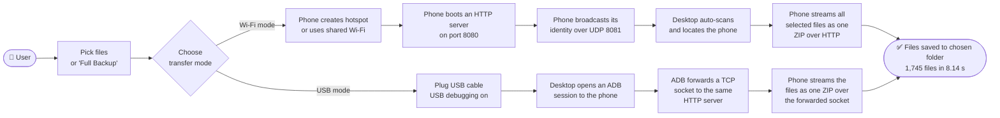
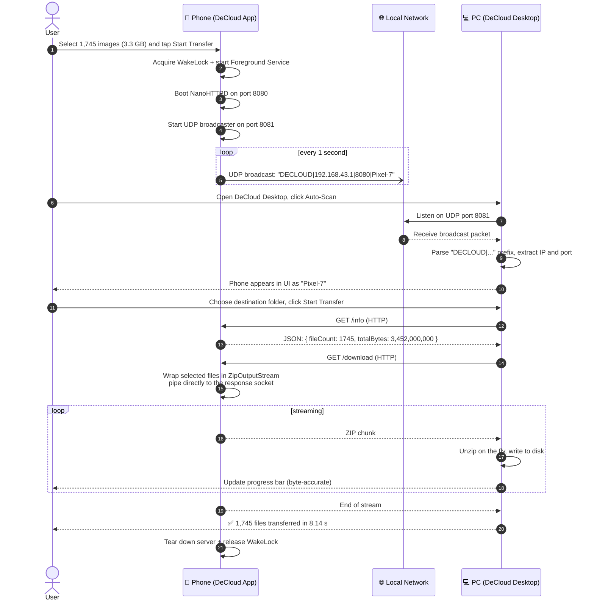
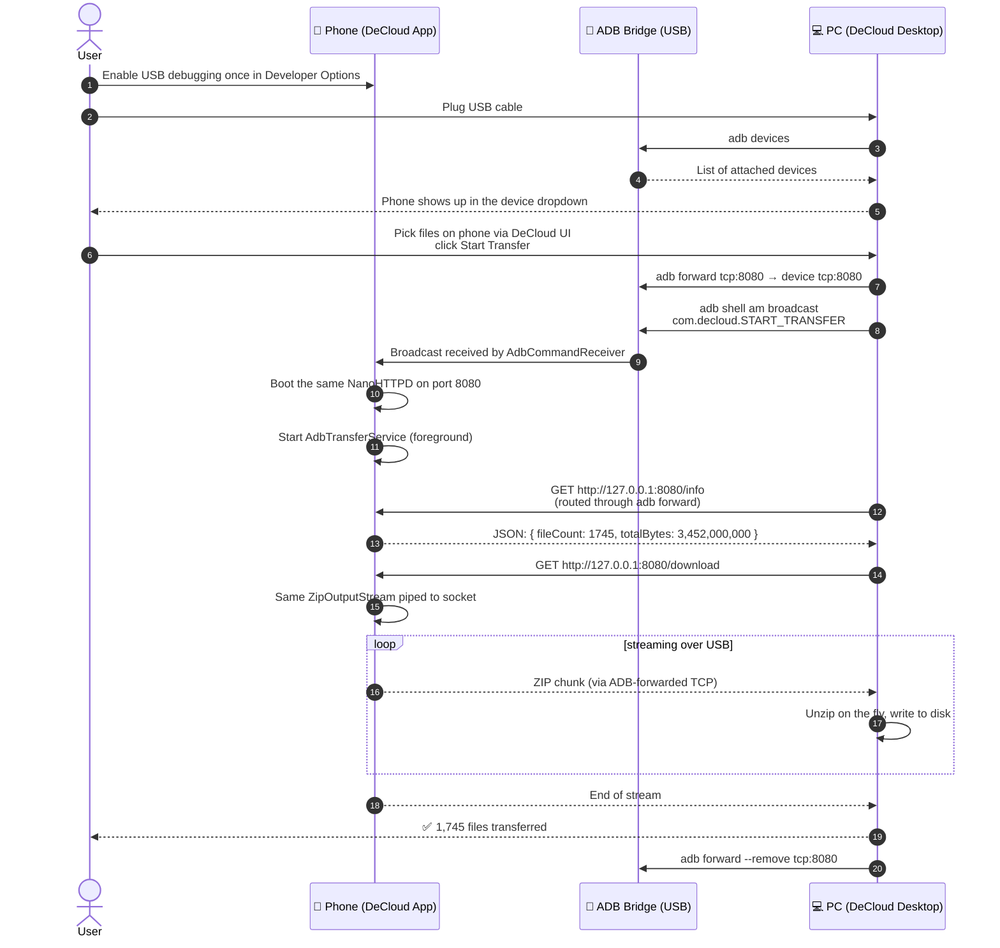
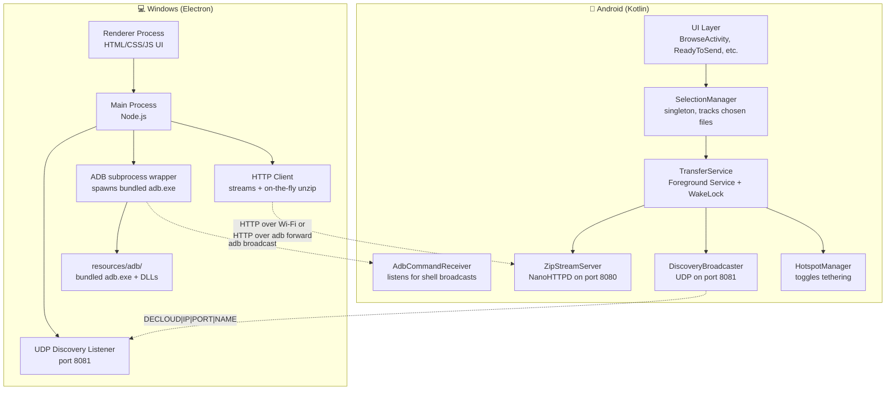
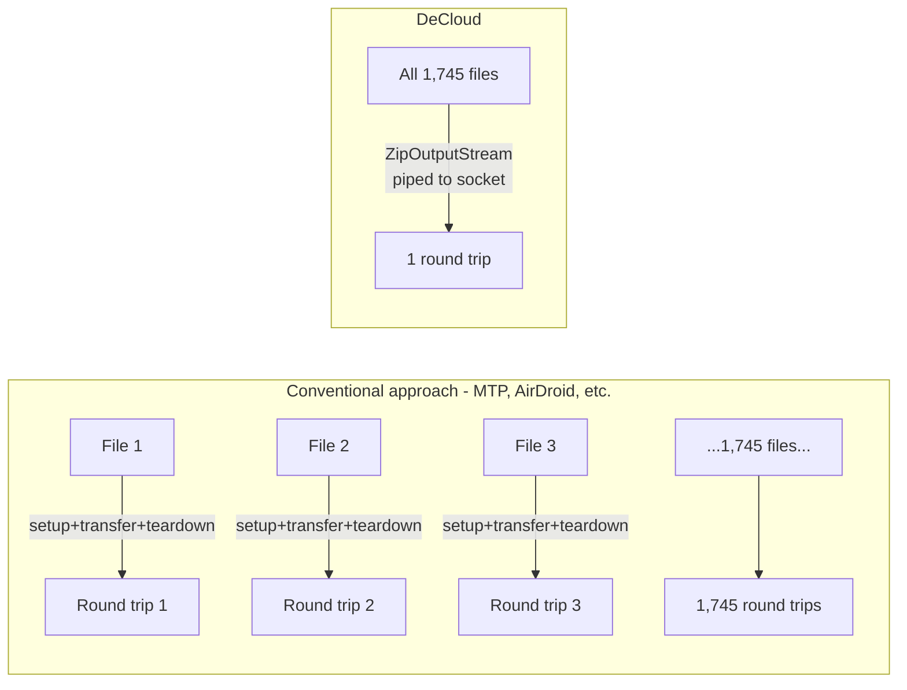

# DeCloud Architecture

How a file actually gets from your phone to your PC, end to end. Three views below: the simple journey, the protocol-level sequence, and the component map.

Every diagram uses the same concrete example throughout: **1,745 image files totaling 3.3 GB**, exactly what the walkthrough video demonstrates.

---

## 1. The user journey (both modes, side by side)

**Reading it:** the only difference between Wi-Fi mode and USB mode is *how the network reaches the phone's HTTP server*. The phone is always the server. The PC is always the client. The transfer itself is identical at the application layer.

---

## 2. What happens behind the scenes (Wi-Fi mode, second by second)

**Key technical detail:** step 16. The phone never writes a ZIP to its own storage. It opens a `ZipOutputStream` that writes *directly into the HTTP response socket*. The PC receives bytes and unzips them as they arrive. No temporary files, no double storage. This is why bulk transfers don't depend on the phone having enough free space to hold a temporary archive.

---

## 3. What happens behind the scenes (USB / ADB mode)

**Key technical detail:** step 8. `adb forward tcp:8080` makes the phone's `localhost:8080` reachable from the PC as if it were the PC's own `localhost:8080`. The HTTP transfer code is **literally the same** as Wi-Fi mode. Only the transport changed.

---

## 4. Component map (what runs where)

**Reading it:** the entire app is two single-process programs talking over standard protocols. No cloud services. No backend. No third-party broker. Two devices, two processes, three protocols (UDP for discovery, HTTP for transfer, ADB as a transport when Wi-Fi isn't available).

---

## 5. The single architectural choice that makes everything fast

Most file transfer apps treat each file as a separate request. For 1,745 files, that means 1,745 TCP setups, 1,745 protocol round trips. The Windows MTP driver does roughly this and that's why Windows estimates 6+ hours for the same files.

DeCloud does *one* request. The phone builds a ZIP stream in memory (no temp file) and writes it directly into the HTTP response socket. The PC reads one continuous stream and unzips on the fly.

**Result:** 8.14 seconds instead of 6+ hours, on the same hardware moving the same bytes.

---

## File map (where to find this in the code)

| Component | Path in the repo |
|---|---|
| HTTP server + ZIP streaming | `DeCloud-Android/app/src/main/java/com/decloud/server/ZipStreamServer.kt` |
| UDP discovery broadcaster | `DeCloud-Android/app/src/main/java/com/decloud/util/DiscoveryBroadcaster.kt` |
| Foreground transfer service | `DeCloud-Android/app/src/main/java/com/decloud/service/TransferService.kt` |
| ADB command receiver | `DeCloud-Android/app/src/main/java/com/decloud/receiver/AdbCommandReceiver.kt` |
| Hotspot manager | `DeCloud-Android/app/src/main/java/com/decloud/hotspot/HotspotManager.kt` |
| Desktop UDP listener + HTTP client + ADB wrapper | `DeCloud-Desktop/src/main.js` |
| Bundled ADB binaries | `DeCloud-Desktop/resources/adb/` |

Read the source. The promise of "nothing leaves your local network" is verifiable in about an hour of reading.
